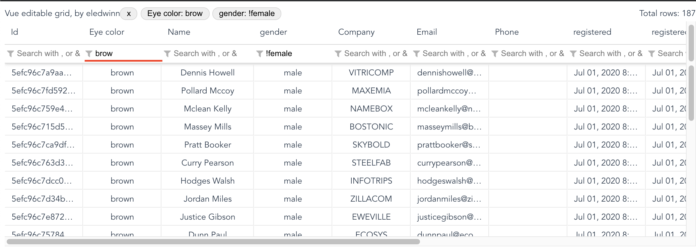
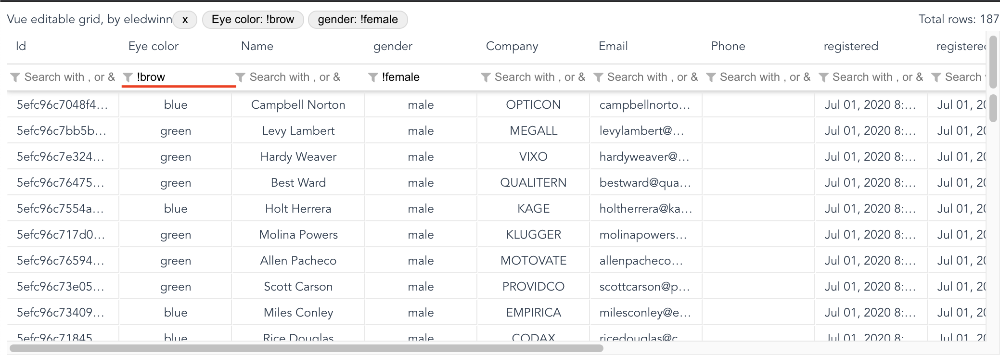
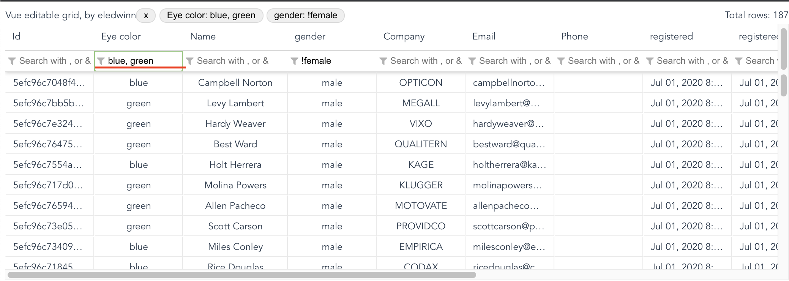

# vue-editable-grid

## How to install

```
npm install vue-editable-grid
```

Then import in you main file

```js
import Vue from 'vue'

// Vue editable grid component and styles
import VueEditableGrid from 'vue-editable-grid'
import 'vue-editable-grid/dist/VueEditableGrid.css'

// register component in the Vue app
Vue.component('vue-editable-grid', VueEditableGrid)
```

Now you can use it
```html
<vue-editable-grid
  class="my-grid-class"
  ref="grid"
  id="mygrid"
  :column-defs="columnDefs"
  :row-data="rows"
  row-data-key='shipmentId'
  @cell-updated="cellUpdated"
  @row-selected="rowSelected"
  @link-clicked="linkClicked"
>
  <template v-slot:header>
    Vue editable grid, by eledwinn
  </template>
  <template v-slot:header-r>
    Total rows: {{ rows.length }}
  </template>
</vue-editable-grid>
```
In your stylesheet:
```css
.my-grid-class {
  height: 400px;
}
```

Column definition format:
```js
const columnDefs = [
  { sortable: true, filter: true, field: 'eyeColor', headerName: 'Eye color', editable: true },
  { sortable: true, filter: true, field: 'name', headerName: 'Name', editable: true },
  { sortable: true, filter: true, field: 'registered', headerName: 'registered', type: 'date', format: 'MMM dd, yyyy', editable: true },
  { sortable: true, filter: true, field: 'age', headerName: 'Age', type: 'numeric', editable: true },
  { sortable: true, filter: true, field: 'balance', headerName: 'Balance', type: 'currency', editable: true },
  { sortable: true, filter: true, field: 'happiness', headerName: 'Happiness percent', type: 'percent', editable: true },
  { sortable: true, filter: true, field: 'isActive', headerName: 'Is active', type: 'boolean', editable: true },
  { sortable: true, filter: true, field: 'picture', headerName: 'Picture', type: 'link', editable: false }
]
```

## Properties

```js
{
  id: { type: String, required: true },
  columnDefs: { type: Array, required: true },
  rowData: { type: Array, required: true },
  rowDataKey: { type: String, required: true },
  enableFilters: { type: Boolean, default: true },
  pageCount: { type: Number, default: 0 },
  itemHeight: { type: Number, default: 30 },
  virtualScrollOffset: { type: Number, default: 3 },
  onlyBorder: { type: Boolean, default: true }
}
```
### id `(String)`
Allow to identify the grid for saving some values in local storage

### columnDefs `(array)`
Define the column definition

### rowData `(array)`
Define the grid content data

### rowDataKey `{string}`
Define the key UNIQUE value in rowData. This field is used in v-for directive.

### enableFilters `{boolean}`
Enable or disable filters row

Default value: `true`

### pageCount `(number)`
Define how many elements per page are showed. If pageCount is `0`, grid pagination is disabled.

Default value: `0`

### itemHeight `(number)`
Height of rows in pixels.

default value: `30`

### virtualScrollOffset `(number)`
How many elements (rows) are rendered outside grid visible scroll.

default value: `3`

### Multicell selection

Select and copy multiple cells in the grid

Use the onlyBorder prop to select the style of the selections:
- `true` (default) just the outline
- `false` select all borders 

## Column definition reference

### sortable
If column can be sort

Default: `false`

### filter
If column can be filtered

Default: `false`

**filter usage**

  - *Normal filter* : Type the value to filter

  

  - *Negative filter* : use ! to filter the data that does not match

  

  - *Or filter* : Filter data that match with some of the values 

  

  - *And filter* : Filter data that match with all values

  

### field
Key name for column in `row-data` items

### headerName
Name for column header

### type
Data type, possible vales: `datetime`, `date`, `text`, `numeric`, `currency`, `boolean`, `percent`.

Default: `text`

### format
Data column format, only apply for `date` and `datetime` column types.

Refer to [date-fns format table](https://date-fns.org/v2.14.0/docs/format) for more details.

### formatter
Function that allow format the display value.

Event object will be received in function as parameter with the following values:

- `value: any`: Raw value 
- `row: Object`: Row object, referenced from array setted in `row-data` property.
- `column: Object`: Column object, referenced from array setted in `column-defs` property.
- `fromInput (boolean)`: Indicates if the value comes from an editable input
- `reverse (boolean)`: Indicates the direction in which to convert.

```js
const numericFormatter = event => {
  if (event.reverse) {
    // Convert from display to raw
    return event.value && Number(event.value.replace(' years'))
  }
  // Convert from raw to display
  return `${event.value} years`
}
```

### editable
Allow to edit column values.

Default: `false`

## Events

### cell-updated
Emited when cell value is changed.

$event object: `{ value, row, column, rowIndex, columnIndex, $event, preventDefault, markAsPending, confirm, markAsFailed, markAsSuccess }`

- value: New cell value
- row: Row object, referenced from array setted in `row-data` property
- column: Column object, referenced from array setted in `column-defs` property
- rowIndex: The row index
- columnIndex: The column index
- $event: Original event reference
- preventDefault: Function that allow prevent cell update
- markAsPending: Function that allow mark as pending editing (loading status) while define if edit can be executed. Use this funcion if you need to use async processes (like server requests) in cellUpdate event handling.
- confirm: Function that allow confirm cell editing. Is only required if you was called markAsPending.
- markAsFailed: Function that allow mark cell when error has occurred. You can pass string parameter with error message. `$event.markAsFailed('Invalid format')`
- markAsSuccess: Function that allow mark cell when error has fixed.

### row-selected
Emited when row selection is changed.

$event object: `{ rowData, colData, rowIndex, colIndex }`

- rowData: Row object, referenced from array setted in `row-data` property.
- colData: Column object, referenced from array setted in `column-defs` property.
- rowIndex: The row index
- colIndex: The column index

### link-clicked
Emited when link cell is clicked.

$event object: `{ rowData, colData, rowIndex, colIndex }`

- rowData: Row object, referenced from array setted in `row-data` property.
- colData: Column object, referenced from array setted in `column-defs` property.
- rowIndex: The row index
- colIndex: The column index


### contextmenu
Emmited when contextmenu is open

$event object: `{ rowData, colData, rowIndex, colIndex }`

- row: Row object, referenced from array setted in `row-data` property.
- column: Column object, referenced from array setted in `column-defs` property.
- rowIndex: The row index
- colIndex: The column index
- $event: contextmenu event

## Methods

You can access to VueEditableGrid instance using `ref` property.
```html
<vue-editable-grid
  ref="grid"
  ...
></vue-editable-grid>
```

In your component script
```js
export default {
  mounted () {
    const data = this.$refs.grid.getFormattedRows()
  },
  ...
}
```

### getFormattedRows()
Allow to get a complete row data passed in `row-data` property but with all format applied. This is very useful for example when you want to export the data.

### copyToClipboard(withHeaders)
Allow to copy to clipboard the selected content grid content. Use `withHeaders(true)` to copy with headers.

Note: Use `Cmd + Shift + C` or `Ctrl + Shift + C` to copy with headers.

## Slots

### Header slots

Use slot `header` and `header-r` to implement own features.

Use only inline/inline-block elements into header for better UX.

## Format rows and cell

You can format cells and rows using the `row-data` prop.

Attach `$cellStyle` or `$cellStyle` objects in each item of `row-data` to format it.

```js
// apply format to all row
$rowStyle = { backgroundColor: 'black', color: '#fff' }

// apply format to field1 and field2 cells in specific row
$cellStyle = {
  field1: { backgroundColor: 'black', color: '#fff' },
  field2: { color: 'rgb(0, 0, 0)' }
}
```

## How to colaborate
```
npm install
```

### Compiles and hot-reloads for development
```
npm run serve
```

### Compiles and minifies for production
```
npm run build
```

### Lints and fixes files
```
npm run lint
```

### Customize configuration
See [Configuration Reference](https://cli.vuejs.org/config/).
